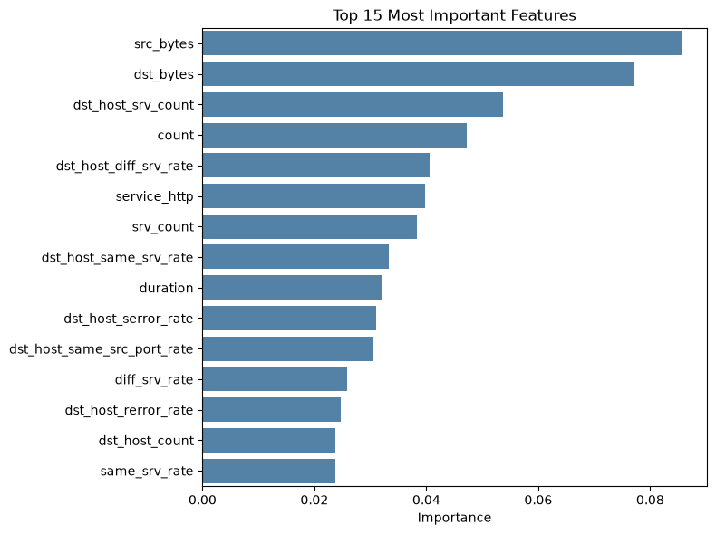

# Network Anomaly Detection Model

A machine learning pipeline that classifies network connections as **normal traffic** or one of four **attack categories** (DoS, Probe, Privilege escalation, and Access), built with pandas and scikit-learn. The project is split into stage-by-stage Jupyter notebooks, each saving its output so the next stage can pick up where the last one left off.

This is a learning project, built while following Hack The Box Academy training and extended with data-quality fixes, a proper train/validation/test workflow, and handling for imbalanced classes.

## Project Structure

```
├── data/                       raw dataset and processed splits (not tracked by git)
├── models/                     trained model (not tracked by git)
├── images/                     charts used in this README
├── import dataset.ipynb        1. download and extract the raw dataset
├── preprocessing.ipynb         2. label, encode, and split the data
├── training.ipynb              3. train, validate, and save the classifier
├── model test.ipynb            4. final evaluation and showcase
└── README.md
```

## Dataset

The model uses the [NSL-KDD](https://www.unb.ca/cic/datasets/nsl.html) dataset, a widely used benchmark for intrusion detection. Each row describes one network connection with 41 features (such as protocol, service, bytes transferred, and connection error rates), plus the attack name and a difficulty level. This project uses the combined training and test files, totaling 148,517 connections.

The individual attack names are grouped into five classes:

| Class | Description | Example attacks |
|---|---|---|
| Normal | Legitimate traffic | — |
| DoS | Denial of service, overwhelming a target | neptune, smurf, teardrop |
| Probe | Scanning and reconnaissance | nmap, portsweep, satan |
| Privilege | Gaining root access from a user account | buffer_overflow, rootkit, loadmodule |
| Access | Gaining access from a remote machine | guess_passwd, warezmaster, httptunnel |

The data is heavily imbalanced: Normal and DoS make up about 88% of all connections, while Privilege attacks are only around 0.1%.

## Pipeline Overview

**1. Import dataset** — Downloads the NSL-KDD dataset, extracts it, and stores it in `data/raw/`.

**2. Preprocessing** — Loads the raw data and maps each attack name to one of the five classes. The mapping raises an error on any unrecognized attack name instead of silently defaulting to Normal; this check uncovered three misspelled entries in the attack lists (`loadmodule`, `httptunnel`, and `xlock`) that had been mislabeling real attacks as normal traffic. The categorical features `protocol_type`, `service`, and `flag` are one-hot encoded and combined with 37 numeric and binary features, giving 121 features in total. The zero-variance column `num_outbound_cmds` is dropped, and the `level` column is excluded since it describes difficulty rather than traffic. Finally, the data is split into training (56%), validation (24%), and test (20%) sets, stratified so every split keeps the same class proportions. The splits are saved with joblib.

**3. Training** — Trains a Random Forest classifier with `class_weight='balanced'`, which makes errors on rare classes count more during training. Model decisions are made using the validation set only, keeping the test set untouched for a single, unbiased final evaluation. The trained model is saved with joblib.

**4. Model test** — Loads the saved model and evaluates it once on the held-out test set. Reports per-class results, an intrusion detection summary, a live demo classifying real connections with the model's confidence, and a chart of the most important features.

## Results

### Intrusion detection summary

Evaluated on the held-out test set of 29,704 connections:

| Metric | Result |
|---|---|
| **Detection rate** | **99.65%** (14,243 of 14,293 attacks flagged) |
| **False alarm rate** | **0.57%** (88 of 15,411 normal connections flagged) |

The detection rate counts an attack as caught when it's flagged as any attack type, which reflects how an intrusion detection system raises alerts in practice.

### Per-class results

| Class | Precision | Recall | F1-score | Support |
|---|---|---|---|---|
| Normal | 1.00 | 0.99 | 1.00 | 15,411 |
| DoS | 1.00 | 1.00 | 1.00 | 10,678 |
| Probe | 0.99 | 1.00 | 0.99 | 2,815 |
| Privilege | 0.62 | 0.67 | 0.64 | 24 |
| Access | 0.93 | 0.95 | 0.94 | 776 |
| **Macro avg** | **0.91** | **0.92** | **0.91** | 29,704 |

Overall accuracy is 99.5%, but macro-averaged scores are used as the main summary, since they weight every class equally and aren't dominated by the large Normal and DoS classes.

The model detects attacks very reliably and separates the major attack types well. Its main weakness is the Privilege class: with only about 120 examples in the whole dataset (24 in the test set), it catches two thirds of these attacks and is sometimes confused with Access or Normal traffic. Results on the validation set were consistent (99.67% detection rate, 0.69% false alarm rate), indicating the model generalizes well to unseen data.

### Effect of class balancing

Measured on the validation set:

| | Default | Balanced |
|---|---|---|
| Privilege attacks caught | 14 of 28 (0.50) | 21 of 28 (0.75) |
| Access attacks caught | 865 of 931 (0.93) | 892 of 931 (0.96) |
| Attacks missed as Normal | 99 | 56 |
| Normal traffic flagged as attack | 63 | 128 |
| Overall accuracy | 1.00 | 0.99 |

Balancing the classes reduced missed attacks by 43%, at the cost of more false alarms (still under 1% of normal traffic). For intrusion detection this is the right trade-off, since a missed attack is far more costly than a false alarm. Notably, overall accuracy *decreased* even though the model got better at its actual job, which shows why accuracy alone is misleading on imbalanced data.

### Feature importance



The model relies most on **`src_bytes`** and **`dst_bytes`**, the amount of data sent in each direction, which together account for about 16% of its decision-making. Many attacks have very distinctive traffic sizes, such as tiny probe packets or oversized payloads. Next come **connection-count features** (`dst_host_srv_count`, `count`, `srv_count`), which capture how many connections were made to the same host or service in a short time window, the typical fingerprint of DoS floods and port scans. **Rate features** like `dst_host_diff_srv_rate` and `dst_host_serror_rate` further help spot scanning across many services and half-open connections.

No single feature dominates (the top one accounts for under 9%), meaning the model combines many signals rather than relying on one rule. Note that importance shows what the model *uses*, not what *causes* an attack, and correlated features tend to share importance between them.

## Getting Started

### Requirements

- Python 3.x with conda
- pandas, scikit-learn, joblib, seaborn, matplotlib, requests

### Setup

```bash
conda create -n nids python
conda activate nids
conda install -c conda-forge pandas scikit-learn joblib seaborn matplotlib requests jupyterlab
```

### Running the pipeline

Run the notebooks **in order**, since each one depends on the files created by the previous stage:

1. `import dataset.ipynb`
2. `preprocessing.ipynb`
3. `training.ipynb`
4. `model test.ipynb`

The `data/` and `models/` folders are excluded from git, so running the full pipeline regenerates everything from scratch.

> **Note:** Saved `.joblib` files are tied to the scikit-learn version used to create them. Use the same environment for every stage.

## Future Improvements

- Improve Privilege detection, e.g. with oversampling techniques like SMOTE or by gathering more examples
- Tune Random Forest hyperparameters (`n_estimators`, `max_depth`) on the validation set
- Evaluate on the official NSL-KDD test file separately, which contains attack types unseen in training
- Compare against other classifiers (e.g. gradient boosting)
- Wrap the model in a simple API for classifying live traffic